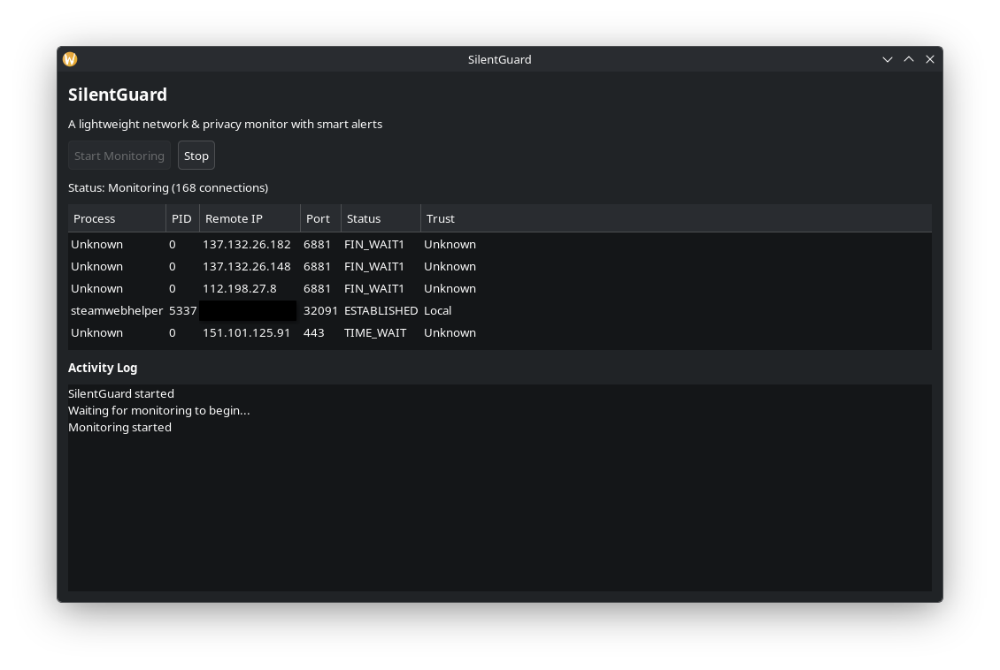

# SilentGuard

[](https://codeberg.org/TheZupZup/SilentGuard/releases)
[](#)
[](#)


A lightweight network & privacy monitor with smart alerts.

SilentGuard helps you visualize outgoing network connections in real time and detect suspicious activity on your system.

---
## Screenshots



---

## Features

- Real-time monitoring of outgoing connections
- Process → IP mapping
- Trust classification with local rules file (`~/.silentguard_rules.json`):
  - Known (process matches `known_processes`)
  - Trusted (remote IP matches `trusted_ips`)
  - Unknown (everything else, surfaced for review)
  - Local (loopback, RFC 1918, link-local)
  - Blocked (remote IP matches `blocked_ips`)
- Detection of new connections
- Simple and clean GTK interface
- TUI mode with memory actions, blocklist updates (`B` key), and JSON export (`E` key)
- Local flood / DDoS-style anomaly detection (visibility only — never
  automatic blocking; cannot absorb upstream bandwidth saturation)

---

## Requirements

- Python 3
- GTK 3
- psutil

---
## Quick start

# Codeberg
```bash
git clone https://codeberg.org/TheZupZup/SilentGuard
cd SilentGuard
pip install .
silentguard
```

# TUI (server / headless)
```
silentguard-tui
```
---

## How to run

```bash
pip install .
silentguard      # GTK GUI
silentguard-tui  # Text UI
silentguard-api  # Read-only local API (optional)
```

## Read-only local API (preview)

SilentGuard ships an optional local-only HTTP API that exposes the same
data the TUI/GUI display. It is intended as the foundation for future
integrations (notably Nova) to consume SilentGuard state.

Important properties:

- **Local-only by default.** Binds to `127.0.0.1:8765`.
- **Read-only.** Only `GET` is supported. The API never blocks IPs,
  unblocks IPs, mutates trusted IPs, or touches the firewall.
- **Optional.** The TUI and GUI work whether or not the API is running.
- **No new dependencies.** Built on the Python standard library.

Start it with:

```bash
silentguard-api               # http://127.0.0.1:8765
silentguard-api --port 9000   # custom port
```

Endpoints:

| Method | Path                            | Purpose                                          |
| ------ | ------------------------------- | ------------------------------------------------ |
| GET    | `/status`                       | API identity / health summary                    |
| GET    | `/connections`                  | Current outgoing connection snapshot             |
| GET    | `/connections/summary`          | Compact aggregate view of outgoing connections   |
| GET    | `/connections/recent-unknown`   | Recently observed unknown destinations (cached)  |
| GET    | `/blocked`                      | Locally-marked blocked IPs from rules            |
| GET    | `/trusted`                      | Trusted IPs from rules                           |
| GET    | `/alerts`                       | Local flood / anomaly alerts (detection only)    |
| GET    | `/alerts/summary`               | Compact alert counts by severity / type          |

Each endpoint returns JSON. Collections use a stable `{"items": [...]}`
shape so future schema additions stay backwards compatible. When data is
not yet available (for example, alerts are not implemented yet), the
response includes `"status": "not_available"` alongside an empty list.

### `/connections/summary`

`/connections/summary` is intended for Nova and other local tools that
want to describe the network state at a glance without parsing the full
connection list. It is **visibility only** — it does not, and never will,
control the firewall, mutate rules, or take any action.

Example payload:

```json
{
  "total": 55,
  "local": 38,
  "known": 12,
  "unknown": 5,
  "trusted": 2,
  "blocked": 0,
  "recent_unknown": [
    {
      "ip": "203.0.113.10",
      "process": "firefox",
      "seen_count": 3,
      "first_seen": "2026-05-09T20:10:00Z",
      "last_seen": "2026-05-09T20:15:00Z",
      "classification": "unknown"
    }
  ],
  "by_process": [
    {"process": "firefox", "count": 8, "known": 6, "unknown": 2}
  ],
  "top_remote_hosts": [
    {"ip": "93.184.216.34", "count": 3, "classification": "known"}
  ]
}
```

Notes:

- Top-level counts use the canonical classifications (`local`, `known`,
  `unknown`, `trusted`, `blocked`). Each connection has exactly one
  classification: blocked > trusted > local > known > unknown.
- `recent_unknown` is read from a small local cache of recently-seen
  unknown destinations (see "Connection classification & unknown
  tracking" below). It is capped to a small safe number per response.
- `by_process` groups connections by process name and is capped to a
  small number of entries.
- `top_remote_hosts` lists the most-frequent non-local remote IPs and is
  also capped. Hostnames are not resolved (the API performs no DNS or
  external network calls), so only the IP is reported.
- When no connections can be enumerated (for example, if `psutil` lacks
  permissions), the response carries zeros plus `"status": "not_available"`.

### `/connections/recent-unknown`

Returns the most-recently-seen unknown destinations from the local
cache, as the read-only equivalent of the `recent_unknown` field in
the summary but with a larger cap so consumers can paginate or browse:

```json
{
  "items": [
    {
      "ip": "203.0.113.10",
      "process": "firefox",
      "seen_count": 3,
      "first_seen": "2026-05-09T20:10:00Z",
      "last_seen": "2026-05-09T20:15:00Z",
      "classification": "unknown"
    }
  ]
}
```

If the cache is unreadable, the response degrades gracefully to
`{"items": [], "status": "not_available"}`.

### `/alerts` and `/alerts/summary`

SilentGuard performs lightweight, **local-only** detection of patterns
that may indicate flood or DDoS-style activity. Alerts surface through
two read-only endpoints.

What this gives you:

- Visibility into the local connection state when something looks wrong.
- Deterministic thresholds with conservative defaults, so a normal
  desktop should not generate alerts.
- A stable JSON shape consumers can rely on as the schema grows.

What this **does not** do — by design, in this PR and going forward
without explicit user opt-in:

- ❌ It does **not** automatically block IPs.
- ❌ It does **not** modify firewall rules (`ufw`, `firewalld`,
  `nftables`, `iptables`).
- ❌ It does **not** run privileged or shell commands.
- ❌ It does **not** take autonomous defensive actions.
- ❌ It does **not** depend on Nova or any other external service.

Honest limitation — please read:

> SilentGuard runs on the local machine. It cannot absorb upstream DDoS
> attacks that saturate the internet uplink before traffic reaches the
> local NIC. For volumetric attacks against a public-facing service,
> use ISP- or edge-level DDoS protection. SilentGuard's detection is
> for **local visibility and alerting only**. Any future mitigation
> must require explicit human confirmation.

Detection signals (current set):

- **Per-remote-IP flood** — one remote IP appears in many concurrent
  outgoing connections.
- **Connection spike** — total active outgoing connections are
  unusually high.
- **Unknown burst** — many distinct unknown remote IPs are active in
  the current snapshot.
- **Connection churn** — many distinct unknown destinations were
  observed in the recent rolling window (5 minutes).

Severity levels are `low`, `medium`, `high`, and `critical`, assigned
deterministically from the count vs. each detector's medium / high /
critical thresholds (see `silentguard/detection.py`).

Example alert object:

```json
{
  "id": "flood-remote-ip-203.0.113.10",
  "severity": "medium",
  "type": "possible_flood",
  "title": "Repeated connections from one remote IP",
  "message": "One remote IP appears in many concurrent outgoing connections, which can indicate a flood pattern. SilentGuard detects only and does not block automatically.",
  "source_ip": "203.0.113.10",
  "count": 120,
  "created_at": "2026-05-09T20:15:00Z",
  "status": "active"
}
```

`window_seconds` is included on alerts that look back over a window
(e.g. churn). Fields whose value is not applicable are omitted from
the payload to keep responses compact.

`/alerts/summary` returns a small overview that's safe to poll:

```json
{
  "total": 2,
  "by_severity": {"low": 0, "medium": 1, "high": 1, "critical": 0},
  "by_type": {"possible_flood": 1, "connection_churn": 1},
  "highest_severity": "high"
}
```

If the underlying monitor cannot enumerate connections, both endpoints
degrade gracefully to an empty payload with `"status": "not_available"`.

The `/alerts` endpoint exposes alert summaries only. It deliberately
does **not** include raw packet data, full process command lines,
process environment variables, or PIDs / ports — see
`silentguard/detection.py` for the schema and `connection_state.py`
for the cache storage policy.

### Connection classification & unknown tracking

SilentGuard owns its classification logic in
`silentguard/connection_state.py` so the TUI, GUI, and API report the
same labels for the same data. Each outgoing connection is classified
exactly once using this precedence:

1. `blocked` — remote IP matches `blocked_ips` in the rules file.
2. `trusted` — remote IP matches `trusted_ips` in the rules file.
3. `local`   — remote IP is loopback, RFC 1918, or link-local.
4. `known`   — process name matches `known_processes`.
5. `unknown` — anything else.

To help local consumers like Nova describe newly-observed traffic,
SilentGuard maintains a small on-disk cache of recently-seen unknown
destinations at `~/.silentguard_unknown.json`. The cache is updated
whenever connections are enumerated (TUI/GUI refresh, or a hit on
`/connections/summary`).

What the cache **stores** for each entry:

- `ip` — remote IP only (no DNS resolution is ever performed).
- `process` — the observed process name, when safely available.
- `first_seen` / `last_seen` — UTC ISO timestamps.
- `seen_count` — number of snapshots in which the destination appeared.
- `classification` — current canonical classification. Entries that
  transition out of `unknown` (e.g. you trusted the IP) keep their row
  with the updated label so the transition is visible.

What the cache **does not** store, by design:

- No PIDs, ports, or per-connection rows.
- No process command lines or arguments.
- No environment variables.
- No raw socket data, packet contents, or byte counters.
- No DNS lookups or remote hostnames sourced from the network.

The cache is local-only and intended as read-only context for tools
that ask SilentGuard about its state. SilentGuard never sends it
anywhere, never blocks IPs based on it, and Nova consumes it only
read-only.

## Rules file (optional)

Create `~/.silentguard_rules.json` to customize trust classification:

```json
{
  "known_processes": ["firefox", "python3"],
  "trusted_ips": ["1.1.1.1"],
  "blocked_ips": ["203.0.113.10"]
}
```

When an IP is in `blocked_ips`, it appears as `Blocked` in the UI/TUI.
When an IP is in `trusted_ips`, it appears as `Trusted` and is reported
separately from `Known` in API summaries.
---

## Arch Linux (AUR - in progress)

You can already build and install manually:

```bash
git clone https://codeberg.org/TheZupZup/SilentGuard
cd SilentGuard/packaging/aur
makepkg -si
```
---
## Mirror & Contributing

- GitLab: https://gitlab.com/TheZupZup/SilentGuard
- Codeberg: https://codeberg.org/TheZupZup/SilentGuard

Contributions welcome! Check the [ROADMAP](ROADMAP.md) and open issues.
Feel free to open a PR or issue on either platform.

## Status 

Early development — actively improving

## Branding

The name "SilentGuard" and associated branding may not be used without permission.
